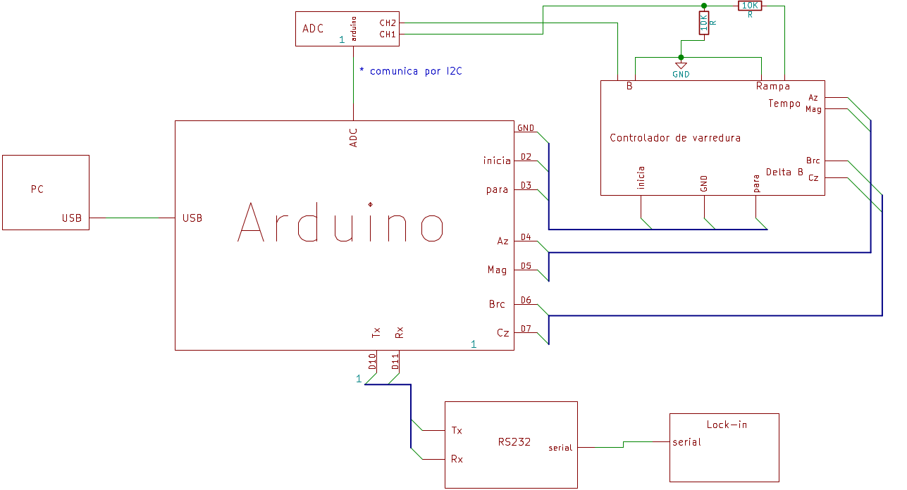
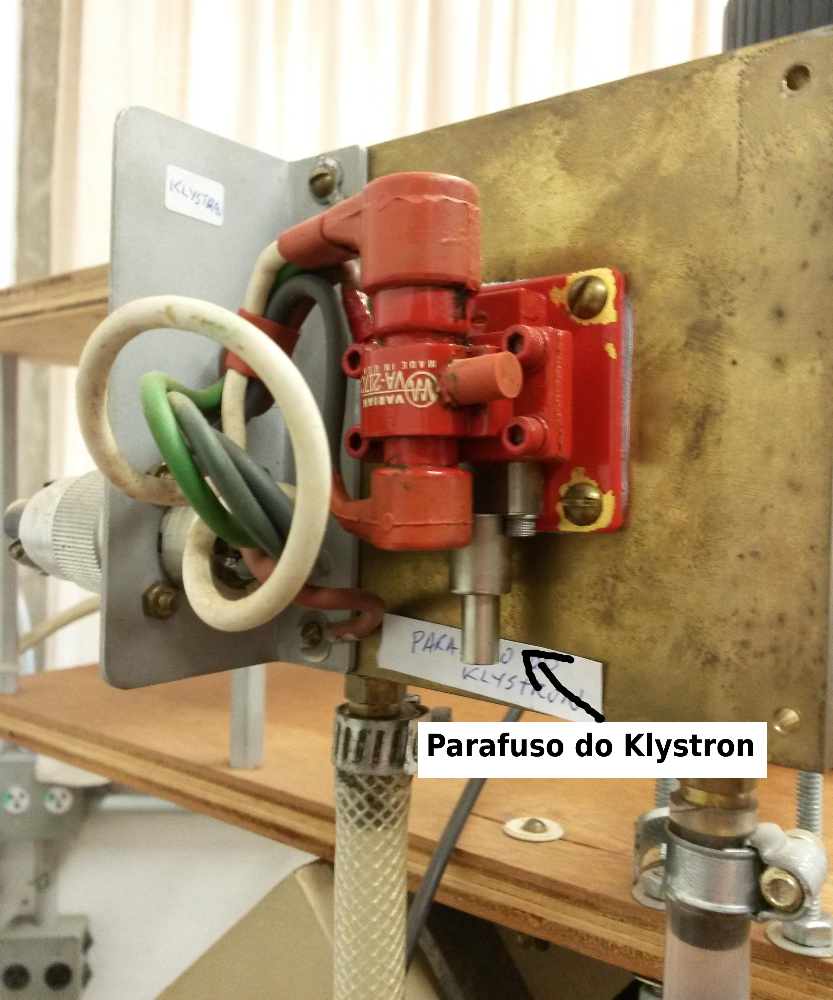
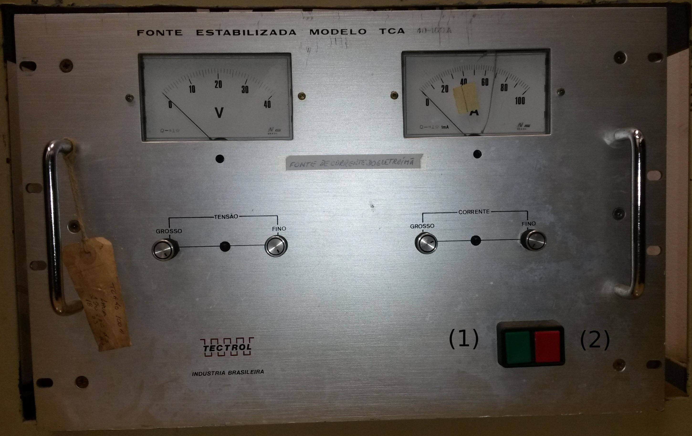
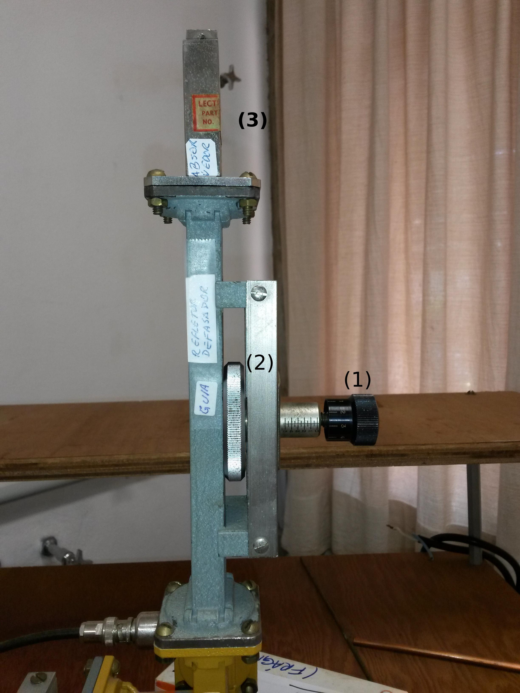
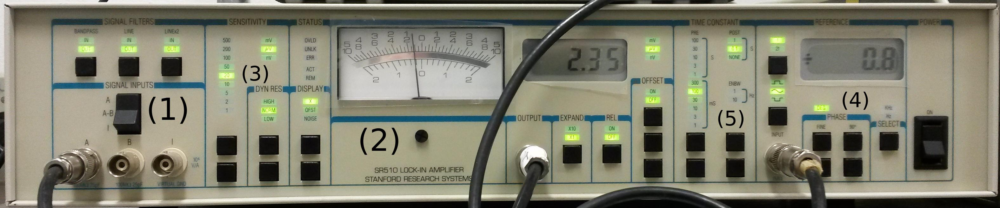

=====================
Montagem Experimental
=====================

Cuidados
--------

Alguns cuidados devem ser tomados *antes e durante* a operação do
equipamento, a fim de que nada seja danificado:

        #. **Tenha certeza de que há água para refrigerar o klystron
           e as bobinas**. Verifique visualmente a circuilação da água e
           fique atento a varições no som da água circuilando.

        #. **Sobrevoltagem no klystron**. Não aplique uma tensão de feixe
           superior a 250 V e uma tensão de refletor superior a 200 V.

        #. **Não lique o klystron antes de o mesmo estar aquecido**. O
           *klystron* pode ser permanentemente danificado caso isso aconteca.
           Aguarde pelo menos dois minutos entre ligar o filamento e aplicar a
           alta tensão no *klystron*. **A água para refrigeração deve estar
           ligada antes destes dois procedimentos**.

Descrição e funcionamento
-------------------------

O equipamento necessário para se fazer espectroscopia por EPR consiste
de um magneto com controle de campo magnético, *klystron* para gerar a
microonda, sistema de modulação de sinal, amplificador *lock-in* e
registrador. Um diagrama da montagem encontra-se na figura
:numref:`fig_diagrama_blocos_trambolho` a seguir.

.. _fig_diagrama_blocos_trambolho:

.. figure:: img/diagrama_blocos_trambolho.jpg
   :scale: 80%
   :align: center

   Diagrama de blocos do EPR

.. _fig_diagrama_blocos_arduino:

   Diagrama das ligações do Arduino com o equipamento utilizado.

Além do registrador mecânico do resultado, foi adicionado um sistema digital
de aquisição de dados, que consiste em um microcontrolador Arduino e uma
interface através de um microcomputador.

Todo o equipamento utilizado está registrado a seguir.

Na figura :numref:`fig_sala` a seguir, vemos como era o equipamento antes da
modernização. Na figura :numref:`fig_sala_nova` a seguir vemos a nova
montagem, com o novo sistema de aquisição de dados utilizando um computador
e Arduino para aquisição e visualização de dados.

.. _fig_sala:

   Foto da sala. (1) magneto, (2) controlador de varredura, (3) osciloscópio analógico,
   (4) fonte do *klystron*, (5) amplificador de audio, (6) *lock-in*, (7)
   frequencímetro, (8) fonte do ímã, (9) refletor desafador de miro-ondas e (10)
   equipamento utilizado para desenhar o sinal do EPR esse aparelho será
   substituído por um sistema de aquisição de dados utilizando um arduino e um
   microcomputador.

.. _fig_sala_nova:

   Foto da sala após a modernização pelos alunos Emilio Galera e Heitor de
   Bittencourt. (1) magneto, (2) controlador de varredura, (3) osciloscópio
   analógico para observar o modo de oscilação do *klystron*, (4) fonte do
   *klystron*, (5) amplificador do sinal de modulação, (6) *lock-in*, (7)
   frequencímetro, (8) fonte do ímã, (9) refletor desafador de miro-ondas,
   (10) computador para aquisição de dados, (11) voltímetro digital de alta
   precisão, (12) gerador de sinais, (13) emissor de microondas *klystron*.

Neste experimento, é utilizada radiação eletromagnética de aproximadamente 10 GHz.
Para emissão desta frequência, é utilizado um *klystron*, modelo VA-217CH, fabricado
pela *Varian* e mostrado na figura :numref:`fig_klystron` abaixo. A fonte para
ligá-lo está mostrada na figura :numref:`fig_fonte_klystron`.

.. TODO principio de funcionamento do klystron aqui. Falar da porra da fonte dele também

.. _fig_klystron:

   Emissor de micro-ondas *klystron*. Note o parafuso cinza. Este ajusta o centro
   de emissão de microondas.

.. _fig_fonte_klystron:

.. figure:: img/fonte_klystron.jpg
   :scale: 80%
   :align: center

   Fonte do *klystron*. (1) medidor da corrente do feixe de etétrons. (2) formato
   da função de onda do *klystron*, pode ser C.W (onda contínua), onda dente de
   "serra" ou onda pulsada. (3) tensão do feixe de elétrons, (4) tensão do refletor
   do feixe. (5) chave para ligar e desligar a fonte, note que a mesma possui 3
   estágios, *off* para desligar o equipamento, *FIL* para ligar apenas a
   tensão do filamento e *HV+FIL* para ligar a alta tensão e a tensão no filamento.
   Não ligue a fonte direramente em *HV+FIl*, o filamento deve esquentar primeiro
   na opção *FIL*.

.. _fig_torneiras:

.. figure:: img/torneiras.jpg
   :scale: 80%
   :align: center

   Registro geral de água (1) e torneiras para refrigeração, ligue apenas a
   torneira (1) e o registro (2). Cuidado para não abrir a torneira errada e
   molhar o equipamento.

.. _fig_controlador_varredura:

.. figure:: img/controlador_varredura.jpg
   :scale: 80%
   :align: center

   Controlador de varredura do campo magnético.
   Chave para ligar e desligar o controlador (1), três botões estilo rádio para
   controlar respectivamente o tempo de varredura (2), a largura do campo varrido (3)
   e o mais importante, :math:`B_0` o referencial do campo para varredura (4). Os
   dois últimos são botões de disparo, para iniciar (5)  e parar (6) a varredura.

.. _fig_fonte_eletroima:

   Fonte do eletroímã. (1) botão para ligar e (2) botão para desligar a fonte.

.. _fig_defasador:

   Refletor defasador de microondas. (1) parafuso para inserir ou retirar o
   defasador da guia de onda, (2) ajuste de fase do defasador. Acima (3)
   encontra-se o absorvedor de microondas.

.. _fig_cavidade:

   Cavidade do espectrômetro. (1) local onde a amostra é colocada. (2) parafuso
   de ajuste de sintonia amostra-cavidade. (3) bobina *pick-up*.

.. _fig_gerador_sinais:

.. figure:: img/gerador_sinais.jpg
   :width: 70%
   :align: center

   Gerador de sinais.

.. _fig_amplificador_audio:

.. figure:: img/amplificador_audio.jpg
   :width: 60%
   :align: center

   Amplificador de audio. (1) botão para ligar. (2) ajustes de ganho.

.. _fig_lockin:

   Amplificador *lock-in*. (1) sinais de entrada, (2) display do aparelho,
   (3) sensibilidade de medida, (4) ajuste de fase do sinal de entrada,
   (5) controle de constantes de tempo para integração do sinal (médias).

   .. TODO colocar evolucao dos arduiinos. Arquivs: arduino-lindo,
      arduino lindo 2....

   .. TODO Atualizar essa foto

.. _fig_arduino_lindo:

   Arduino com módulos *ADC*, *RS-232*, no interior do controlador de
   varredura.

Instruções
----------

Existe um conjunto de passos que devem ser seguidos para operar este
espectrômetro. Alguns equipamentos são sensíveis a pequenas variações
de algum parâmetro e queimam facilmente.

Se você queimar o *klystron*, você *será* jubilado. Há três modos simples
para isso acontecer:

        #. Superaquecimento do *klystron*.

        #. Tensão do feixe superior a 250 V ou do refletor superior a 200 V.

        #. Ligar o *klystron* antes do mesmo estar aquecido.

Muito cuidado ao manusear os tubinhos de amostra. Eles são feitos de quartzo
ultrapuro, para não haver impurezas magnéticas. Por esse motivo, são muito
caros e também frágeis.

Siga os passos abaixo para ligar e desligar corretamente o equipamento.

Ligar o espectrômetro
~~~~~~~~~~~~~~~~~~~~~

        #. Certifique-se de que os disjuntores da sala (atrás da porta)
           encontram-se ligados.

        #. Abra o registro de água e a torneira para refrigerar o *klystron*
           e o eletroímã, :numref:`fig_torneiras`.

           De tempos em tempos, verifique com os dedos a temperatura do
           *klystron* e das bobinas. O *klystron* deve estar morno, isto é, o
           contato com seus dedos nao deve ser desconfortável. As bobinas
           devem estar na temperatura ambiente.

           Caso você perceba algum aquecimento, chame o técnico do
           laboratório *imediatamente*.

        #. Ligue o controle de varredura, :numref:`fig_controlador_varredura`,
           do campo e coloque o potenciômetro B0 em zero.

        #. Coloque a amostra *DPPH* na cavidade. Esse passo é crítico. Caso
           a amostra não esteja corretamente no centro da cavidade, será
           muito difícil obter um sinal.

           A amostra é bem pequena e encontra-se no fundo do tubo. Antes de
           inserir a amostra na cavidade, meça a posição do centro, como na
           :numref:`fig_amostra_centro`.

           .. TODO colocar as outras imagens da amostra em lugar errado?

           .. _fig_amostra_centro:

           .. figure:: img/amostra_centro.jpg
              :width: 70%
              :align: center

              Posição correta da amostra na cavidade. Note que existem 2 entradas
              para colocar amostras, (1) e (2). Isso será importante para os
              experimentos.

        #. Ligue a fonte de corrente do eletroíma,
           :numref:`fig_fonte_eletroima`, e coloque seus controles de voltagem
           e corrente no máximo.

        #. Aumente B_0 no controlador de varredura até que a corrente do
           eletroímã esteja perto de 32 A.

        #. Verifique os controles da fonte do *klystron*
           (:numref:`fig_fonte_klystron`): *beam*: 250 V, *refletor*: 150 V,
           *function*: dente de serra.

        #. Ligue a fonte do *klystron* na primeira posição (*FIL*), aguarde
           dois minutos e passe para a posição *HV-FIL*. Esse atraso é
           importante para dar tempo ao filamento do *klystron* se aquecer.
           Se o filamento não estiver aquecido, o *klystron* pode se destruir.
           Imediatamente após ligar *HV-FIL*, verifique se a corrente do
           feixe (*beam Curent*) indica próximo de 30 mA. Caso não esteja,
           chame o técnico do laboratório.

        #. Ligue o osciloscópio no modo XY e ajuste a amplitude de modulação
           na fonte do *klystron*  para observar o modo de oscilação do
           *klystron* e de absorção da cavidade, como mostrado nas figuras
           :numref:`fig_klystron_sintonia_cavidade` e
           :numref:`fig_klystron_fora_sintonia_cavidade`.

           .. TODO fotos to osciloscopio mostrando o klystron oscilando na cavidade:
           .. fora de sintonia e em sintonia.

           .. _fig_klystron_sintonia_cavidade:

           .. figure:: img/cavidade_klystron.jpg
              :width: 40%
              :align: center

              Klystron em sintonia com a cavidade.

           .. _fig_klystron_fora_sintonia_cavidade:

           .. figure:: img/cavidade_klystron_fora_sintonia.jpg
              :width: 40%
              :align: center

              Klystron fora de sincronia

           Talvez seja necessário ajustar o parafuso do *klystron*,
           :numref:`fig_klystron` para centralizar a absorção da cavidade no
           centro do modo.

        #. No defasador de microondas, :numref:`fig_defasador`, desparafuse o
           pino (sentido anti-horário) até que não haja reflexão de microondas.
           Você saberá que não há mais reflexão de microondas quando não houver
           mudança na forma do modo ao deslocar a posição do pino. Basta
           desparafusar algumas voltas, não retire o parafuso que controla a
           profundidade do pino.

        #. Se o item anterior foi executado corretamente, a única microonda
           que atinge o detector é a refletida pela cavidade. Estava deve ser
           nula quando a frequência do *klystron* for igual à de ressonância
           da cavidade. Observando a absorção da cavidade no osciloscópio,
           ajuste o parafuso de sintonia da cavidade, :numref:`fig_cavidade`,
           para máximo acoplamento. Utilize uma chave de fenda não-magnética,
           de latão ou cobre.

           .. TODO fotos iguais a da fig7 do magon:

           .. figure:: img/acoplamento_cavidade_klystron1.jpg
              :width: 28%
              :align: center

              Klystron fora de sintonia.

           .. figure:: img/acoplamento_cavidade_klystron2.jpg
              :width: 28%
              :align: center

              klystron em sintonia, cavidade desacoplada.

           .. figure:: img/acoplamento_cavidade_klystron3.jpg
              :width: 28%
              :align: center

              klystron ok e cavidade ok.

        #. Introduza reflexão no defasador parafusando o pino (sentido
           horário). Observando o osciloscópio, desloque o mínimo da
           absorção da cavidade verticalmente, aproximadamente uma divisão,
           conforme ilustrado na :numref:`fig_reflexao_boa` a seguir.

           .. TODO FIGURA AQUI: Sem reflexao, com reflexao.

           .. _fig_reflexao_boa:

           .. figure:: img/reflexao_boa.jpg
              :width: 50%
              :align: center

              Reflexão de microonda desloca o mínimo de absorção.

        #. Observe a mudança na forma do sinal no osciloscópio quando você
           altera a fase do braço de referência. Ajuste a fase da reflexão
           para que o mínimo de absorção tenha um valor máximo.

        #. Mude a função de modulação do *klystron* de dente de serra para
           *CW*. Ajuste a voltagem do refletor para que o ponto no
           osciloscópio tenha um valor mínimo. Para fins de referência,
           ajuste a posição desse ponto no centro da tela do osciloscópio
           (ajustes no osciloscópio apenas), :numref:`fig_ponto_centro`.

           .. _fig_ponto_centro:

           .. figure:: img/CW.jpg
              :width: 50%
              :align: center

              Ponto centralizado na tela.

           De tempos em tempos, verifique se o ponto continua no centro da tela.
           Talvez seja necessário refazer este ajuste após um tempo de
           operação do espectrômetro.

        #. Ligue o gerador de sinais, :numref:`fig_gerador_sinais`. Selecione
           onda senoidal de cerca de 25 kHz. E ligue o amplificador de áudio,
           :numref:`fig_amplificador_audio`, com ganho de 1X.

           Ligue a bobina *pick-up*, :numref:`fig_cavidade` a um osciloscópio e
           observe o sinal. Altere a frequência para maximizar o sinal visto.

        #. Antes de ligar o lock-in, :numref:`fig_lockin`, certifique-se de que
           o mesmo esteja conectado corretamente.

           Verifique se o input do lock-in está ligado ao gerador de funções.

           Verifique se a entrada A esteja recebendo o sinal do receptor de
           microondas.

           Ligue o lock-in. Em seu painel verifique a sensibilidade está
           marcando :math:`200 \mu V`, *offset* desligado e constante de tempo
           em :math:`100 ms`.

        #. Agora deve ser possível observar o sinal do EPR no display do lock-in.
           No controlador de varredura, varie B_0 até que no display do lock-in
           seja possível observar uma variação brusca do sinal. Varie B_0 com
           cuidado, o aparelho é muito sensível a pequenas variações de campo.

        #. Talvez seja necessário ajustar a fase do *lock-in*. Para isso, varie
           B0 até achar um pico de sinal. Após achar o campo tal que o sinal
           é máximo, altere a fase do amplificador em :math:`90 ^\circ` e faça
           um ajuste fino para que o sinal seja minimizado. Em seguida, retire
           a fase de :math:`90 ^\circ`. É muito mais fácil minimizar o sinal em
           quadratura do que maximizar o sinal em fase.

        #. Verifique se o cabo *USB* do controlo de varredura esta ligadno no
           computdaor.

        #. Inicie o programa EPR-LEF com o comando python EPR-LEF.py.

           Neste programa, o usuario tem controle sobre o tempo da verredura
           e o intervalo de campo a ser medido.

           Há também a opção de salvar ou ler um gráfico, limpar a tela do
           gráfico e iniciar e parar a varredura.

           Exemplo de uma aquisição está na :numref:`fig_screenshot` a seguir.

           .. _fig_screenshot:

           .. figure:: img/sinal-epr.png
              :width: 100%
              :align: center

              Tela do programa, após uma aquisição com 1000 gauss de
              varredura.

Desligar o espectrômetro
~~~~~~~~~~~~~~~~~~~~~~~~

        #. No defasador, desparafuse o pino até que não haja mais reflexão
           de microondas.

        #. Na fonte do *klystron*, coloque na função dente de serra.

           Desligue a alta tensão. Para isso, coloque a chave em *FIL*.

           Obersve no osciloscópio o sinal do klystron desaparecer e depois
           deligue a fonte (*OFF*).

        #. No controle de varredura do campo, coloque B0 em zero e *depois*
           desligue a fonte de corrente do eletroímã. Isso é necessário para
           evitar que a tensão contraeletromotriz queime a eletrônica.

        #. Desligue todos os demais equipamentos.

        #. Retire a amostra da cavidade e guarde no lugar correto.

        #. Feche o registro de água.

        #. Organize a sala.

        #. Desligue os disjuntores da sala.

Parâmetros Iniciais do Espectrômetro
------------------------------------

========================    ==============================   ============
Fonte do *klystron*         *Lock-in*                        Amplificador
========================    ==============================   ============
Beam voltage: 250 V         Sensitivity: 200 :math:`\mu V`   Ganho: 1X.
Reflector voltage: 150 V    Time constant: 100 ms
Function: CW
========================    ==============================   ============
