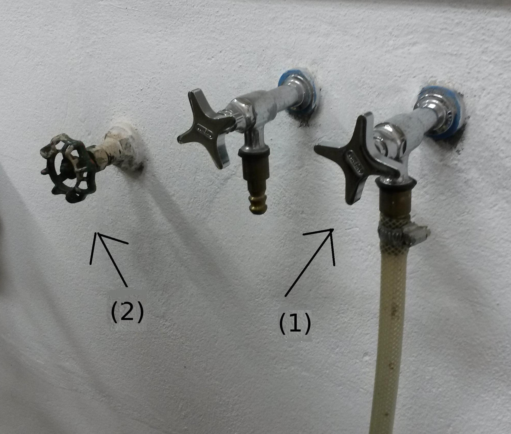
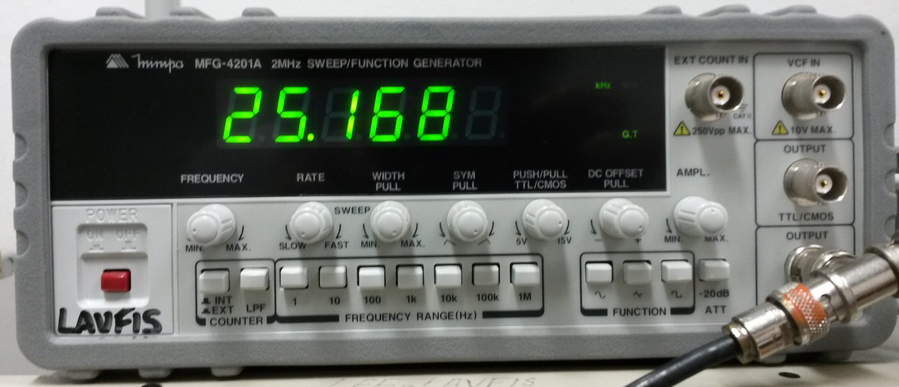
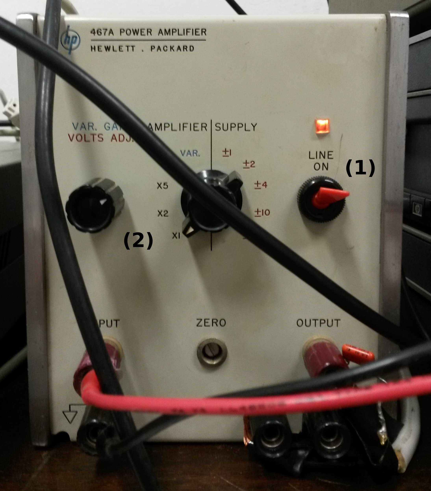

=====================
Montagem Experimental
=====================

Equipamento
-----------

Coisas a fazer nessa seção>

        #. Escrever um texto

        #. colocar foto da sala

        #. Melhorar a legenda *descrever* cada foto.

        #. colocar diagrama de blocos do arduino no trambolho

.. _fig_diagrama_blocos_trambolho:

.. figure:: img/diagrama_blocos_trambolho.jpg
   :scale: 80%
   :align: center

   Diagrama de blocos do trambolho

.. _fig_torneiras:

   Registro geral de água e torneiras para refrigeração.

.. _fig_controlador_varredura:

.. figure:: img/controlador_varredura.jpg
   :scale: 80%
   :align: center

   Controlador de varredura do campo magnético.

.. _fig_fonte_eletroima:

.. figure:: img/fonte_TCA.jpg
   :scale: 80%
   :align: center

   Fonte do eletroímã.

.. _fig_fonte_klystron:

.. figure:: img/fonte_klystron.jpg
   :scale: 80%
   :align: center

   Fonte do *klystron*.

.. _fig_klystron:

.. figure:: img/klystron.jpg
   :scale: 80%
   :align: center

   O *klystron*.

.. _fig_defasador:

.. figure:: img/defasador.jpg
   :scale: 80%
   :align: center

   Defasador de microondas.

.. _fig_cavidade:

.. figure:: img/cavidade.jpg
   :scale: 80%
   :align: center

   Cavidade do espectrômetro.

.. _fig_gerador_sinais:

   Gerador de sinais.

.. _fig_amplificador_audio:

   Amplificador de audio.

Instruções
----------

Existe um conjunto de passos que devem ser seguidos para operar este
espectrômetro. Alguns equipamentos são sensíveis a pequenas variações
de algum parâmetro e queimam facilmente.

Se você queimar o *klystron*, você *será* jubilado. Há três modos simples
para isso acontecer:

        #. Superaquecimento do *klystron*.

        #. Tensão do feixe superior a 250 V ou do refletor superior a 200 V.

        #. Ligar o *klystron* antes do mesmo estar aquecido.

Muito cuidado ao manusear os tubinhos de amostra. Eles são feitos de quartzo
ultrapuro, para não haver impurezas magnéticas. Por esse motivo, são muito
caros e também frágeis.

Siga os passos abaixo para ligar e desligar corretamente o equipamento.

Ligar o espectrômetro
~~~~~~~~~~~~~~~~~~~~~

        #. Certifique-se de que os disjuntores da sala (atrás da porta)
           encontram-se ligados.

        #. Abra o registro de água e a torneira para refrigerar o *klystron*
           e o eletroímã, :numref:`fig_torneiras`.

           De tempos em tempos, verifique com os dedos a temperatura do
           *klystron* e das bobinas. O *klystron* deve estar morno, isto é, o
           contato com seus dedos nao deve ser desconfortável. As bobinas
           devem estar na temperatura ambiente.

           Caso você perceba algum aquecimento, chame o técnico do
           laboratório *imediatamente*.

        #. Ligue o controle de varredura, :numref:`fig_controlador_varredura`,
           do campo e coloque o potenciômetro B0 em zero.

        #. Coloque a amostra *DPPH* na cavidade. Esse passo é crítico. Caso
           a amostra não esteja corretamente no centro da cavidade, será
           muito difícil obter um sinal.

           A amostra é bem pequena e encontra-se no fundo do tubo. Antes de
           inserir a amostra na cavidade, meça a posição do centro, como na
           :numref:`fig_amostra_centro`.

           .. TODO colocar as outras imagens da amostra em lugar errado?

           .. _fig_amostra_centro:

           .. figure:: img/amostra_centro.jpg
              :width: 75%
              :align: center

              Posição correta da amostra na cavidade.

        #. Ligue a fonte de corrente do eletroíma,
           :numref:`fig_fonte_eletroima`, e coloque seus controles de voltagem
           e corrente no máximo.

        #. Aumente B_0 no controlador de varredura até que a corrente do
           eletroímã esteja perto de 32 A.

        #. Verifique os controles da fonte do *klystron*
           (:numref:`fig_fonte_klystron`): *beam*: 250 V, *refletor*: 150 V,
           *function*: dente de serra.

        #. Ligue a fonte do *klystron* na primeira posição (*FIL*), aguarde
           dois minutos e passe para a posição *HV-FIL*. Esse atraso é
           importante para dar tempo ao filamento do *klystron* se aquecer.
           Se o filamento não estiver aquecido, o *klystron* pode se destruir.
           Imediatamente após ligar *HV-FIL*, verifique se a corrente do
           feixe (*beam Curent*) indica próximo de 30 mA. Caso não esteja,
           chame o técnico do laboratório.

        #. Ligue o osciloscópio no modo XY e ajuste a amplitude de modulação
           na fonte do *klystron*  para observar o modo de oscilação do
           *klystron* e de absorção da cavidade.

           TODO fotos to osciloscopio mostrando o klystron oscilando na cavidade:
           fora de sintonia e em sintonia.

           Talvez seja necessário ajustar o parafuso do *klystron*,
           :numref:`fig_klystron`  para centralizar a absorção da cavidade no
           centro do modo.

        #. No defasador de microondas, :numref:`fig_defasador`, desparafuse o
           pino (sentido anti-horário) até que não haja reflexão de microondas.
           Você saberá que não há mais reflexão de microondas quando não houver
           mudança na forma do modo ao deslocar a posição do pino. Basta
           desparafusar algumas voltas, não retire o parafuso que controla a
           profundidade do pino.

        #. Se o item anterior foi executado corretamente, a única microonda
           que atinge o detector é a refletida pela cavidade. Estava deve ser
           nula quando a frequência do *klystron* for igual à de ressonância
           da cavidade. Observando a absorção da cavidade no osciloscópio,
           ajuste o parafuso de sintonia da cavidade, :numref:`fig_cavidade`,
           para máximo acoplamento. Utilize uma chave de fenda não-magnética,
           de latão ou cobre.

           TODO fotos iguais a da fig7 do magon:
           klystron fora de sintonia.
           klystron em sintonia, cavidade desacoplada.
           klystron ok e cavidade ok.

        #. Introduza reflexão no defasador parafusando o pino (sentido
           horário). Observando o osciloscópio, desloque o mínimo da
           absorção da cavidade verticalmente, aproximadamente uma divisão,
           conforme ilustrado na (REFERENCIA DA FIG AQUI) a seguir.

           TODO FIGURA AQUI: Sem reflexao, com reflexao.

        #. Observe a mudança na forma do sinal no osciloscópio quando você
           altera a fase do braço de referência. Ajuste a fase da reflexão
           para que o mínimo de absorção tenha um valor máximo.

        #. Mude a função de modulação do *klystron* de dente de serra para
           *CW*. Ajuste a voltagem do refletor para que o ponto no
           osciloscópio tenha um valor mínimo. Para fins de referência,
           ajuste a posição desse ponto no centro da tela do osciloscópio
           (ajustes no osciloscópio apenas).

           TODO foto do ponto no centro.

        #. Ligue o gerador de sinais, :numref:`fig_gerador_sinais`. Selecione
           onda senoidal de cerca de 25 kHz. E ligue o amplificador de áudio,
           :numref:`fig_amplificador_audio`, com ganho de 1X.

           Ligue a bobina *pick-up*, :numref:`fig_cavidade` a um osciloscópio e
           observe o sinal. Altere a frequência para maximizar o sinal visto.

        #. Antes de ligar o lock-in certifique-se de que o mesmo esteja conectado corretamente.

	   Verifique se o input do lock-in está ligado ao gerador de funções.

	   verifique se a entrada A esteja recebendo o sinal do receptor de micro-ondas.

           Ligue o lock-in, em seu painel verifique a sensibilidade (sensitivity) esta marcando 200 uV, verifique se o offset do aparelho esta em off.

        #. Agora deve ser possível observar o sinal do EPR no display do lock-in. No controlador de varredura varie B_0 até que no display do lock-in seja possível observar uma variação brusca do sinal. Varie B_0 com cuidado, o aparelho é muito sensível a pequenas variações de campo.

	#. Antes de ligar o arduino na saída USB do computador verifique se os fios estão ligados corretamente.
           Verifique se as saídas Rx e Tx do shield RS232 estão ligados nos pinos 11 e 10 do arduino respectivamente.
           No conversor ADC verifique se os pinos A1 e GND estão ligados na saída marcada de campo magnético do controlador de varredura.

	#. Inicie o programa EPR-LEF com o comando python EPR-LEF.py.

           Nesse programa o usuário tem controle sobre o número de pontos a
           serem coletados para o gráfico e o número de amostragem para
           média assim, por exemplo, se o usuário colocar 1000 pontos e 50
           médias o gráfico ira conter 1000 pontos e cada ponto será a média
           de 50 amostragens do lock-in.

           Há também a opção de salvar ou ler um gráfico, limpar a tela do
           gráfico e parar a varredura.

           Exemplo de uma aquisição está na :numref:`fig_screenshot` a seguir.

           .. _fig_screenshot:

           .. figure:: img/sinal-epr.png
              :width: 75%
              :align: center

              Tela do programa.

Desligar o espectrômetro
~~~~~~~~~~~~~~~~~~~~~~~~

        #. No defasador, desparafuse o pino até que não haja mais reflexão
           de microondas.

        #. Na fonte do *klystron*, coloque na função dente de serra.

           Desligue a alta tensão. Para isso, coloque a chave em *FIL*.

           Obersve no osciloscópio o sinal do klystron desaparecer e depois
           deligue a fonte (*OFF*).

        #. No controle de varredura do campo, coloque B0 em zero e *depois*
           desligue a fonte de corrente do eletroímã. Isso é necessário para
           evitar que a tensão contraeletromotriz queime a eletrônica.

        #. Desligue todos os demais equipamentos.

        #. Retire a amostra da cavidade e guarde no lugar correto.

        #. Feche o registro de água.

        #. Organize a sala.

        #. Desligue os disjuntores da sala.

Parâmetros Iniciais do Espectrômetro
------------------------------------

========================    ==============================   ============
Fonte do *klystron*         *Lock-in*                        Amplificador
========================    ==============================   ============
Beam voltage: 250 V         Sensitivity: 200 :math:`\mu V`   Ganho: 1X.
Reflector voltage: 150 V    Time constant: 100 ms
Function: CW
========================    ==============================   ============

Práticas
--------

Aqui a gente explica cada passo pra ligar o bagulho, como fazer os ajustes finos,
pra que serve?

Colocar as práticas aqui ou em arquivo/secao sepsarada?
