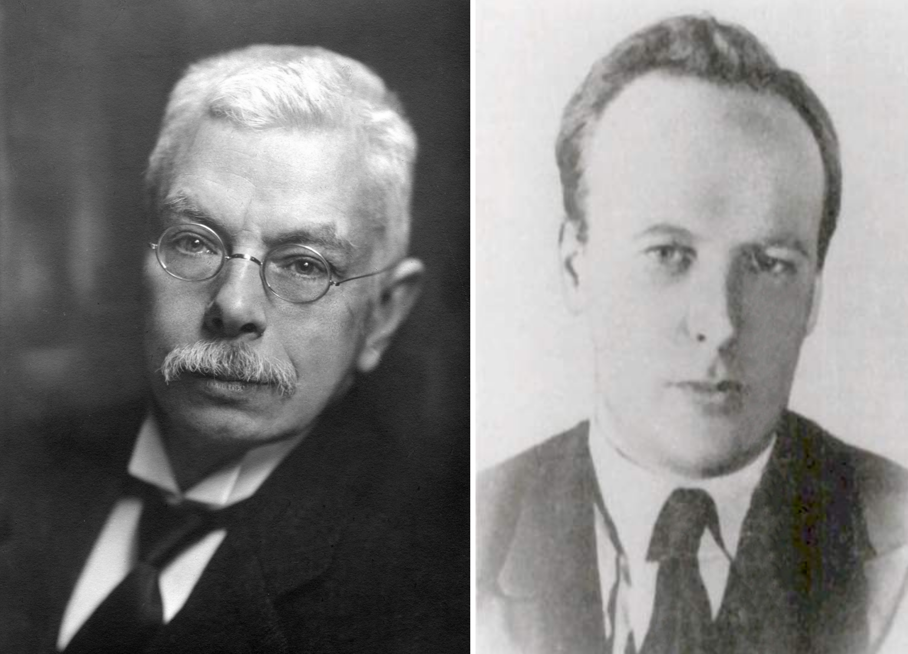

==========
Introdução
==========

.. TODO fotos dos cara aqui

Em 1896, Pieter Zeeman desobedeceu as ordens diretas de seu supervisor sobre
utilizar equipamentos de laboratório para medir a separação das linhas
espectrais por um *forte* campo magnético. Ele foi demitido por seus esforços,
mas mais tarde ele obteve seu reconhecimento: ganhou o Prêmio Nobel de
Física de 1902 pela descoberta de que agora é conhecido como o efeito Zeeman.

Thomas Preston descobre em 1897 uma
separação anômala em linhas espectrais de amostras na presença de campos
eletromagnéticos fortes, conhecido como efeito Zeeman anômalo.

Em 1921 Gerlach e Stern observaram que um feixe de átomos de prata submetido a
um campo magnético se divide em dois.

Tais experimentos não podem ser explicados pela física clássica e nem
completamente pela teoria quântica sem spin. Foram Uhlenbeck e Goudsmit que
deram uma interpretação correta ao efeito Zeeman anômalo, eles postularam o
spin eletrônico, um momento angular quantizado, como uma propriedade
intrínseca do elétron.

Essas pesquisas marcaram os fundamentos da espectroscopia por ressonância
magnética eletrônica (EPR), pois ela é baseada na transição entre estados
quantizados resultante da interação do spin eletrônico com o campo
magnético esterno.

Em 1931, Breit e Rabi descreveram os níveis de energia do hidrogênio sobre o
efeito de um campo magnético. Rabi estudou transições entre níveis de
energia induzidos por um campo magnético oscilante. Este foi o primeiro
experimento a observar ressonância magnética (MNR).

Em 1945, foi feita a primeira observação de um pico de ressonância
paramagnetica eletronica (EPR), quando Zavoisky detectou a linha de absorção
de radiofrequência de uma amostra de CuCl2.2H2O.

.. _fig_ZeemanZavoisky:

   A esquerda vamos Pieter Zeeman, descobriu a separação de linhas espectrais
   devido a campos magnéticos o que ficou conhecido como efeito Zeeman.
   A direita temos Yevgeny Konstantinovich Zavoisky, ele foi o primeiro a medir
   efeito de ressonância paramagnética eletrônica.

A montagem deste experimento nos `Laboratório Avançado de Física
<http://www.ifsc.usp.br/~lavfis/>`_ do `Instituto de Física de São Carlos
<http://www.ifsc.usp.br>`_ começou com o professor Horácio Carlos Panepucci e
o professor Claudio José Magon terminou a primeira versão. Finalmente na
segunda metade do ano de 2016, sob supervisão do professor Luiz Antônio de
Oliveira Nunes e do técnico Antenor Fabbri Petrilli Filho, os alunos Emilio
Frari Galera e Heitor Pascoal de Bittencourt desenvolveram um sistema digital
para aquisição dos espectros.

O novo sistema foi desenvolvido utilizando um microcontrolador *Atmega328p*, da
plataforma *Arduino*, com módulos para: comunicação digital com o amplificador
*lock-in* e conversor analógico-digital para leitura do campo magnético. Além
da eletrônica, foi desenvolvida uma interface gráfica para aquisição dos
espectros utilizando linguagem *Python 2.7*.

Emilio, nao sei onde essas referêcias se encaixam:

bla :cite:`Junk2012` bla

ble :cite:`HyperESR` ble

Mas agora temos referências!! \o/
