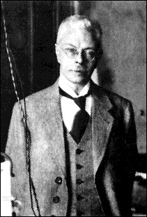
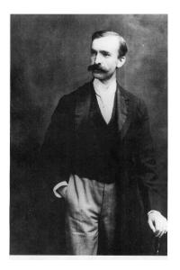
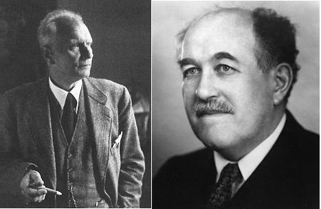
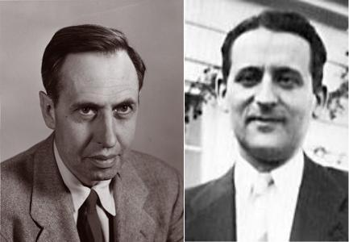
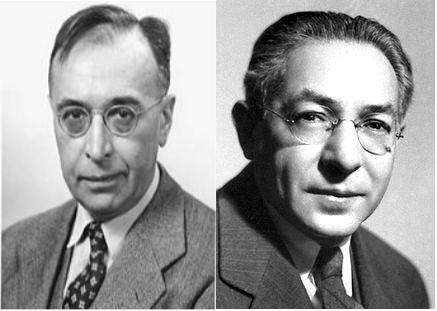

==========
Introdução
==========

.. TODO fotos dos cara aqui

Em 1896, Pieter Zeeman desobedeceu as ordens diretas de seu supervisor sobre
utilizar equipamentos de laboratório para medir a separação das linhas
espectrais por um *forte* campo magnético. Ele foi demitido por tal
insubordinação mas, mais tarde obteve seu reconhecimento: ganhou o Prêmio
Nobel de Física de 1902 pela descoberta de que agora é conhecido como o efeito
Zeeman :cite:`ZeemanFired`.

.. _fig_Zeeman:

   Pieter Zeeman, físico dinamarquês que ganhou o prêmio Nobel em 1902 pela
   discoberta do Efeito Zeeman :cite:`wiki:Zeeman`.

Thomas Preston descobre em 1897 uma separação anômala em linhas espectrais de
amostras na presença de campos eletromagnéticos fortes, conhecido como efeito
Zeeman anômalo. Tal efeito recebe o nome de anômalo pois o spin eletrônico
ainda era desconhecido.

.. _fig_Thomas:

   Thomas Preston, físico irlandês que descobriu o efeito Zeeman Anômalo
   :cite:`wiki:thomas`.

.. TODO colocar referencias das fotos dos caras, pode ser wikipedia mesmo

Em 1921 Gerlach e Stern observaram que um feixe de
átomos de prata submetido a um campo magnético se divide em dois.

.. _fig_Gerlach-Stern:

   A esquerda temos Walther Gerlach e a direita Otto Stern

Em uma primeira aproximação o efeito *Zeeman* pode ser explicado devido a
interação do momento angular orbital da amostra com o campo magnético aplicado
porém, o experimento de *Gerlach* e o exterimento de *Thomas* necessitam de
algo mais na teoria quântica que ainda não havia sido proposto.

Foram Uhlenbeck e Goudsmit :numref:`fig_UhlenbeckGoudsmit` que deram uma interpretação correta ao efeito
Zeeman anômalo, eles postularam o spin eletrônico, um momento angular
quantizado, como uma propriedade intrínseca do elétron.

.. _fig_UhlenbeckGoudsmit:

   Uhlenbeck a esquerda e Goudsmit a direita

Essas pesquisas marcaram os fundamentos da espectroscopia por ressonância
magnética eletrônica (EPR), pois ela é baseada na transição entre estados
quantizados resultante da interação do spin eletrônico com o campo
magnético esterno.

Em 1931, Breit e Rabi :numref:`fig_BreitRabi` descreveram os níveis de energia do hidrogênio sobre o
efeito de um campo magnético. Rabi estudou transições entre níveis de
energia induzidos por um campo magnético oscilante. Este foi o primeiro
experimento a observar ressonância magnética (MNR).

.. _fig_BreitRabi:

   Breit a esquerda e Rabi a adireita

Em 1945, foi feita a primeira observação de um pico de ressonância
paramagnetica eletronica (EPR), quando Zavoisky :numref:`fig_ZeemanZavoisky` detectou a linha de absorção
de radiofrequência de uma amostra de CuCl2.2H2O.

Apesar do NMR ser mais utilizado, as duas técnicas, EPR e NMR, se desenvolveram
praticamente juntas. Em meados da década de sessenta a espectroscopia por NMR
massa por um grande avanço com o desenvolvimento de espectroscopia NMR por FT
(transformada de Fourier). A técnica equivalente para o EPR demorou a ser
desenvolvida devido a dificuldades intrínsecas de se trabalhar com micro-ondas.

Atualmente já existem espectrômetros EPR comerciais :cite:`EPR-comercial`.

.. _fig_ZeemanZavoisky:

   A esquerda vamos Pieter Zeeman, descobriu a separação de linhas espectrais
   devido a campos magnéticos o que ficou conhecido como efeito Zeeman.
   A direita temos Yevgeny Konstantinovich Zavoisky, ele foi o primeiro a medir
   efeito de ressonância paramagnética eletrônica.

A montagem deste experimento nos `Laboratório Avançado de Física
<http://www.ifsc.usp.br/~lavfis/>`_ do `Instituto de Física de São Carlos
<http://www.ifsc.usp.br>`_ começou com o professor Horácio Carlos Panepucci e
o professor Claudio José Magon terminou a primeira versão. Finalmente na
segunda metade do ano de 2016, sob supervisão do professor Luiz Antônio de
Oliveira Nunes e do técnico Antenor Fabbri Petrilli Filho, os alunos Emilio
Frari Galera e Heitor Pascoal de Bittencourt desenvolveram um sistema digital
para aquisição dos espectros.

O novo sistema foi desenvolvido utilizando um microcontrolador *Atmega328p*, da
plataforma *Arduino*, com módulos para: comunicação digital com o amplificador
*lock-in* e conversor analógico-digital para leitura do campo magnético. Além
da eletrônica, foi desenvolvida uma interface gráfica para aquisição dos
espectros utilizando linguagem *Python 2.7*.

Emilio, nao sei onde essas referêcias se encaixam:

bla :cite:`Junk2012` bla

ble :cite:`HyperESR` ble

Mas agora temos referências!! \o/
