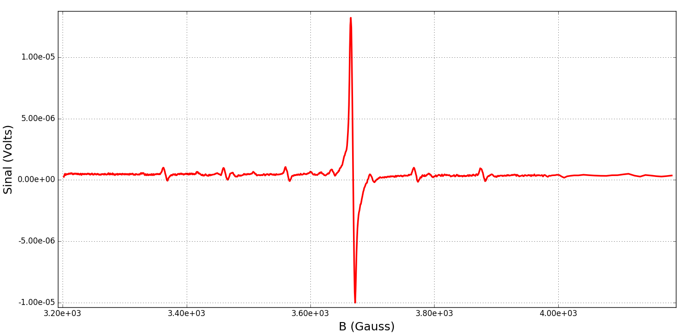

==========
Resultados
==========

DPPH
----

Para a amostra *DPPH*, obtivemos os seguintes espectros, com parâmetros
de varredura diferentes:

.. _fig_DPPH_1kgauss_5min:

   Espectro de DPPH, com 1000 gauss de varredura de campo magnético, realizado
   durante cinco minutos. No *lock-in*, a sensibilidade de :math:`200 \, \mu V` e
   constante de tempo de 30 ms.

.. _fig_DPPH_50gauss_1min:

   Espectro de DPPH, com 50 gauss de varredura de campo magnético, realizado
   durante um minuto. No *lock-in*, a sensibilidade de :math:`200 \, \mu V` e
   constante de tempo de 100 ms.

MgO + Cr3+ Mn2+
---------------

Para a amostra de :math:`MgO + Cr^{3+} Mn^{2+}`, realizamos uma medida com
varredura de 1000 gauss, já que as linhas do íon de manganês tem uma
distância da ordem de 100 gauss cada:

.. _fig_amostra2_supersinal:

   Espectro da amostra *MgO + Cr + Mn* com varredura de 1000 gauss, realizado
   durante cinco minutos. No *lock-in*, a sensibilidade de :math:`20 \, \mu V` e
   constante de tempo de 100 ms.

Podemos ver claramente o pico central do íon de Cromo e cinco picos de menor
intensidade do íon de Manganês.

DPPH + MgO + Cr3+ Mn2+
----------------------

Para a combinação de ambas as amostras, realizamos duas medidas. Todas com
varredura de 1000 gauss com duração de 5 minutos, mas constantes de tempo
do *lock-in* diferentes.

Nesse caso, a intensidade máxima do sinal obtido foi de :math:`15 \mu V`.
Vemos que é possível identificar picos de sinal de cerca de dezenas de nV com
esse equipamento.

Podemos ver claramente que aumentar a constante de tempo do amplificador
reduz o ruído do sinal, mas também altera a forma dos picos.

.. _fig_duasAmostras-1Kgauss-5min-1ms:

   Espectro das duas amostras combinadas, com varredura de 1000 gauss,
   realizada durante 5 minutos. No *lock-in*, a sensibilidade de
   :math:`100 \, \mu V` e constante de tempo de 1 ms.

.. _fig_duasAmostras-1Kgauss-5min-30ms:

.. figure:: img/duasAmostras-1Kgauss-5min-30ms.png
   :width: 100%
   :align: center

   Espectro das duas amostras combinadas, com varredura de 1000 gauss,
   realizada durante 5 minutos. No *lock-in*, a sensibilidade de
   :math:`100 \, \mu V` e constante de tempo de 30 ms.

Os dois picos centrais, de alte intensidade são referentes à *DPPH*, com
campo menor, e o *Cromo*, com campo ligeiramente maior. Os cinco picos pequenos
são do *Manganês*.
