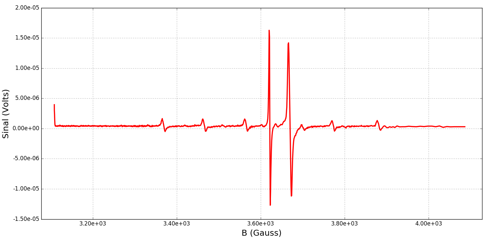

==========
Resultados
==========

DPPH
----

Para a amostra *DPPH*, obtivemos os seguintes espectros, com parâmetros
diferentes:

.. _fig_DPPH_1kgauss_05min:

.. figure:: img/DPPH-1Kgauss-05min.png
   :width: 100%
   :align: center

   Espectro de DPPH, com 1000 gauss de varredura de campo magnético, realizado
   durante meio minuto.

.. _fig_DPPH_50gauss_1min:

.. figure:: img/DPPH-50gauss-1min.png
   :width: 100%
   :align: center

   Espectro de DPPH, com 50 gauss de varredura de campo magnético, realizado
   durante um minuto.

:math:`MgO + Cr^{3+} Mn^{2+}`
------------------------------

Para a amostra de :math:`MgO + Cr^{3+} Mn^{2+}`, realizamos uma medida com
varredura de 1000 gauss, já que as linhas do íon de manganês tem uma
distância da ordem de 100 gauss cada:

.. _fig_amostra2_supersinal:

.. figure:: img/super-sinal.png
   :width: 100%
   :align: center

   Espectro da amostra *MgO + Cr + Mn* com varredura de 1000 gauss.

DPPH + :math:`MgO + Cr^{3+} Mn^{2+}`
------------------------------------

Para a combinação de ambas as amostras, realizamos três medidas. Todas com
varredura de 1000 gauss com duração de 5 minutos, mas constantes de tempo
do *lock-in* diferentes.

Nesse caso, a intensidade máxima do sinal obtido foi de :math:`1 \mu V`.
Vemos que é possível identificar picos de sinal de cerca de dezenas de nV com
esse equipamento.

Podemos ver claramente que aumentar a constante de tempo do amplificador
reduz o ruído do sinal, mas também altera a forma dos picos.

.. _fig_duasAmostras-1Kgauss-5min-10ms:

.. figure:: img/duasAmostras-1Kgauss-5min-10ms.png
   :width: 100%
   :align: center

   Espectro das duas amostras combinadas, com varredura de 1000 gauss,
   realizada durante 5 minutos. Consante de tempo do *lock-in* de 10 ms.

.. _fig_duasAmostras-1Kgauss-5min-30ms:

   Espectro das duas amostras combinadas, com varredura de 1000 gauss,
   realizada durante 5 minutos. Consante de tempo do *lock-in* de 30 ms.

.. _fig_duasAmostras-1Kgauss-5min-100ms:

.. figure:: img/duasAmostras-1Kgauss-5min-100ms.png
   :width: 100%
   :align: center

   Espectro das duas amostras combinadas, com varredura de 1000 gauss,
   realizada durante 5 minutos. Consante de tempo do *lock-in* de 100 ms.